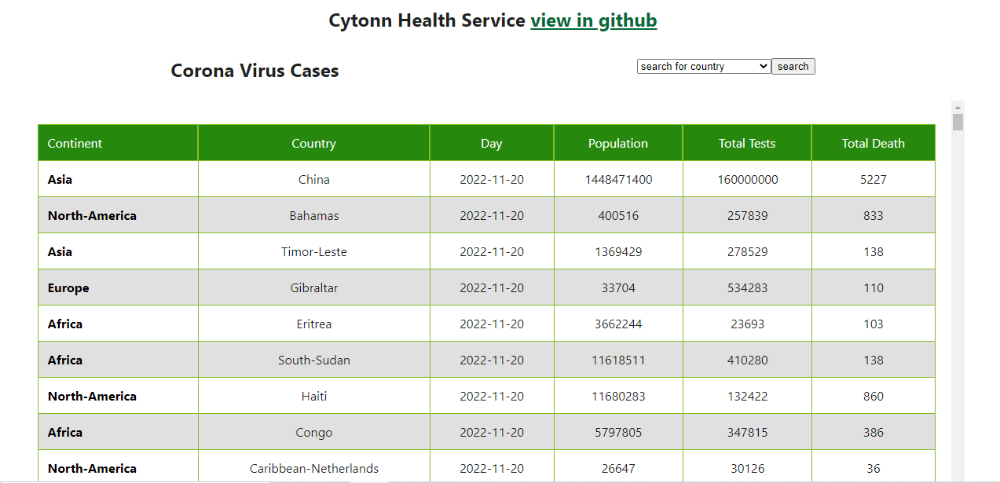
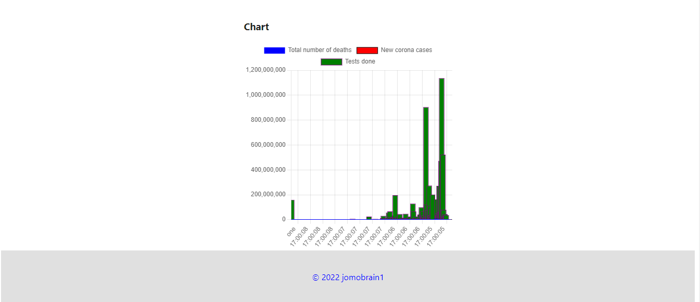

<h1>Frontend Engineering Internship - Coding Challenge</h1>

<section style="display:flex;justify-content: space-around;align-items:center;">

1.Api Documentation 
<a  href="https://rapidapi.com/api-sports/api/covid-193/"> click here</a>  

<a href="https://cytonjomo.netlify.app/" target="_blank">checkout project</a>

</section>

 
 

<a href="https://cytonjomo.netlify.app/" target="_blank">visit project</a>